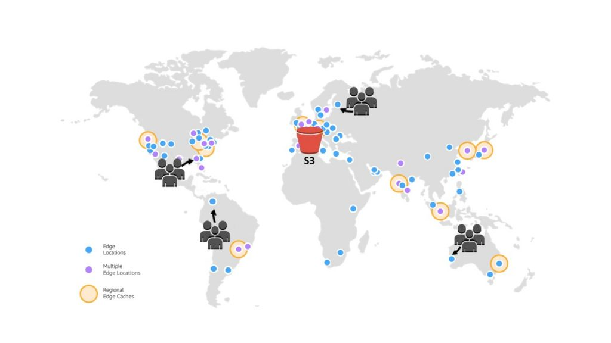

# CDK Exercises

CDK Exercises to complete.

1. ## Bootstrap an account/region combination

### Description

Bootstrap the eu-central-1 region for your AWS account, using the CDK Toolkit.

2. ## Initialise a new TypeScript CDK project

### Description

Create a CDK TypeScript project, using the CDK Toolkit.

3. ## S3 Bucket

### Description

Create and deploy an S3 Bucket which has the following:

- SSE-S3 encryption enabled
- Versioning enabled
- Populated with a .zip file using a bucket deployment

4. ## Route53 -> CloudFront Distribution -> S3

### Description

- [x] Create a private S3 Bucket in the Europe London region

- [x] Store static content in the S3 bucket (index.html and 404.html doc) with a bucket deployment of a .zip archive

- [x] Create a Cloudfront Distribution with the S3 Bucket as the Origin, making use of Edge locations

- [ ] Configure the CloudFront Distribution to send authenticated requests to Amazon S3 with Origin Access Control (OAC)

- [ ] 

- [ ] Setup GEO Restriction on the CloudFront Distribution to prevent access from a certain location

- [ ] Integrate the CloudFront Distribution with AWS WAF

- [ ] Use WAF to block certain IP ranges requesting content from the CloudFront Distribution

- [ ] Create an ACM certificate for HTTPS using a custom domain with a Route53 Hosted Zone

- [ ] Use [Tool](https://geopeeker.com/) to request the website from 6 different regions to view response latency
