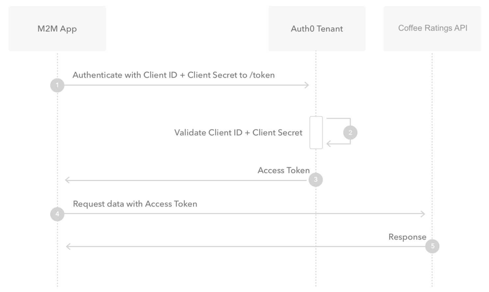

# Coffee Ratings

REST API for coffee ratings.

## Technology Choices

- Titus Accelerator (backend and db-manager packages)
- Node.js
- PostgreSQL
- Fastify Server
    - fastify-auth
    - fastify-auth0-verify
    - fastify-jwt-authz
    - fastify-postgres
- Docker

## Prerequisites
- Node.js
- npm
- Docker
- docker-compose
- curl

## Authentication flow

This REST API is protected with the machine-to-machine (M2M) Client Credentials authentication and authorization flow, as shown in the diagram below:



## Authenticating, Authorizing and making requests

In order to authenticate and authorize to make requests, follow the steps outlined below:

**1. Install npm modules for database and backend. Start and seed the database. Start the API.**

**2. Contact me on Twitter DM for client_id and client_secret @MattLongCode**

**3. Request a valid JWT containing an access_token value**

```bash
curl --request POST \
    --url https://dev-pbiznxd2.eu.auth0.com/oauth/token \
    --header 'content-type: application/json' \
    --data '{"client_id":"CLIENT-ID-HERE","client_secret":"CLIENT-SECRET-HERE","audience":"http://localhost:8080","grant_type":"client_credentials"}'
```

**4. Check your JWT is valid and contains all the correct client scopes needed**

You can validate your JWT using the [JSON Web Token debugger](https://jwt.io/?value=debugger)

The client scopes you need to use the API are:

- coffees.create
- coffees.read
- coffees.read
- coffees.update
- coffees.delete

**5. You are now ready to make requests to the API. Example requests and responses are shown below:**


**GET /coffees**
```bash
curl --request GET \
    --url http://127.0.0.1:8080/coffees \
    --header 'content-type: application/json' \
    --header 'authorization: Bearer ACCESS-TOKEN-HERE'
```

**example GET /coffees response**

```json
[{"name":"affogato","description":"Espresso poured on a vanilla ice cream. Served in a cappuccino cup."},{"name":"americano","description":"Espresso with added hot water (100–150 ml). Often served in a cappuccino cup. (The espresso is added into the hot water rather than all the water being flowed through the coffee that would lead to over extraction.)"}
]

```

**GET /coffee/1**
```bash
curl --request GET \
    --url http://127.0.0.1:8080/coffees/1 \
    --header 'content-type: application/json' \
    --header 'authorization: Bearer ACCESS-TOKEN-HERE'
```

**example GET /coffee/1 response**

```json
[{"name":"affogato","description":"Espresso poured on a vanilla ice cream. Served in a cappuccino cup."}]
```

**POST /coffees**

```bash
curl --request POST \
    --url http://127.0.0.1:8080/coffees \
    --header 'content-type: application/json' \
    --data '{"name":"affogato", "description":"Espresso poured on a vanilla ice cream. Served in a cappuccino cup."}' \
    --header 'authorization: Bearer ACCESS-TOKEN-HERE'
```

**example POST /coffees response**

```json
[{"name":"affogato","description":"Espresso poured on a vanilla ice cream. Served in a cappuccino cup."}]
```

**PUT /coffees**

```bash
curl --request POST \
    --url http://127.0.0.1:8080/coffees/1 \
    --header 'content-type: application/json' \
    --data '{"name":"a", "description":"b"}' \
    --header 'authorization: Bearer ACCESS-TOKEN-HERE'
```

**example PUT /coffees response**
```json
[{"name":"a","description":"b"}]
```

**DELETE /coffees/1**

```bash
curl --request DELETE \
    --url http://127.0.0.1:8080/coffees/1 \
    --header 'content-type: application/json' \
    --header 'authorization: Bearer ACCESS-TOKEN-HERE'
```

**example DELETE /coffees/1 response**
```json
{ "deletedCount": 1, "coffeeIdDeleted": 1 }
```

